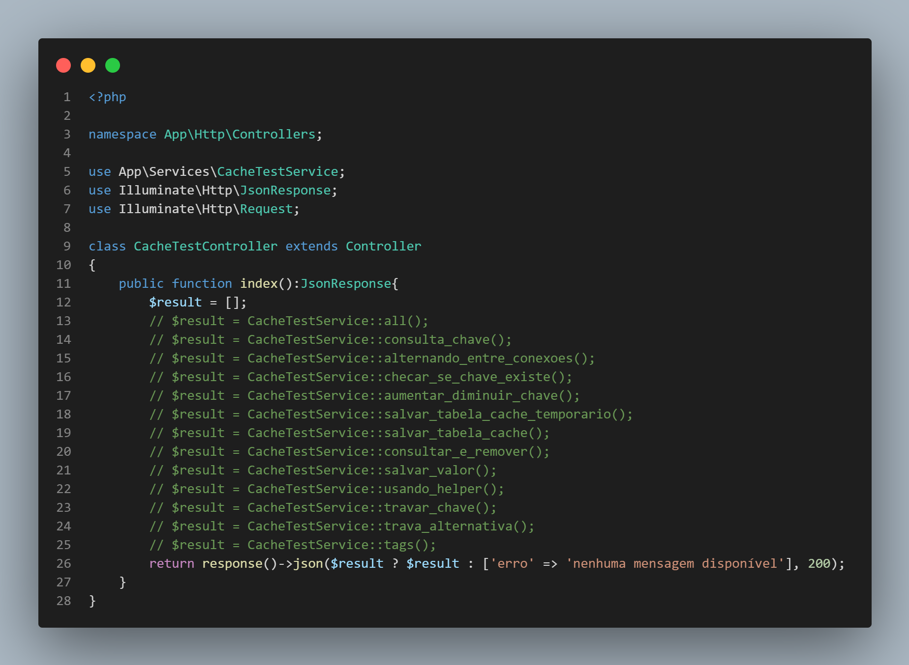

<h2>Laravel API de Cache | Tutorial PT-BR do básico ao avançado!</h2>

Documentação oficial do Laravel Cache. <a href="https://laravel.com/docs/9.x/cache" title="Documentação oficial do Laravel Cache" alt="Link da Documentação oficial do Laravel Cache" target="_blank">Clique aqui!</a> 
<h3> Tutorial 01 </h3>
Vídeo sobre o Laravel Cache, como funciona, drivers disponíveis, variáveis de ambiente e muito mais. <a href="https://youtu.be/3_vncON9tx8" title="Vídeo Tutorial sobre o Laravel Cache" alt="Vídeo Tutorial sobre o Laravel Cache" target="_blank">
Clique aqui!
</a> 
Mada de conteúdo do Tutorial 01

  
<h3> Tutorial 02 </h3>
No segundo tutorial vamos colocar a mão na massa e testar todos os recuros disponíveis na API de Cache do Laravel. <a href="#" title="Laravel Cache colocando a mão na massa com exemplos!" alt="Laravel Cache colocando a mão na massa com exemplos!" target="_blank">
Clique aqui!
</a>

  

<h2>Sobre a Solução</h2>
Foi implementando em na controller `CacheTestController` todos os métodos utilizados para demonstração da API de recursos de Cache do Laravel.

